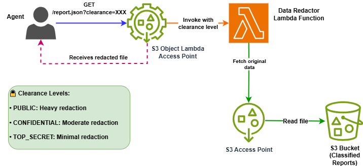

# 🕵️ Secret Agent Data Redactor

An educational demo showcasing S3 Lambda Object Access Points for dynamic data redaction based on user clearance levels.


## Scenario

A spy agency stores classified intelligence reports in S3. When agents access reports through the Object Lambda Access Point, sensitive information is automatically redacted based on their security clearance level:

- **PUBLIC**: Heavy redaction (names, locations, dates, operations)
- **CONFIDENTIAL**: Moderate redaction (agent names, specific locations)  
- **TOP_SECRET**: Minimal redaction (only the most sensitive operational details)

## Architecture



```
Agent Request → S3 Object Lambda Access Point → Lambda Function → Redacted Report
                        ↓
                S3 Access Point → S3 Bucket (Original Reports)
```

## Files

- `template.yaml` - SAM template defining infrastructure
- `src/index.js` - Lambda function for data redaction
- `mock-data/mission-report-001.json` - Sample classified report
- `deploy.sh` / `deploy.ps1` - Deployment and testing scripts (Bash/PowerShell)
- `samconfig.toml.template` - AWS SAM deployment configuration template

## Deployment

**Linux/Mac:**
```bash
chmod +x deploy.sh
./deploy.sh
./deploy.sh --region your-aws-region
./deploy.sh --profile your-aws-profile
./deploy.sh --region your-aws-region --profile your-aws-profile
```

**Windows:**
```powershell
.\deploy.ps1
.\deploy.ps1 -Region your-aws-region
.\deploy.ps1 -Profile your-aws-profile
.\deploy.ps1 -Region your-aws-region -Profile your-aws-profile
```

## Manual Testing

**Linux/Mac:**
```bash
# Get bucket and OLAP ARNs from stack outputs
STACK_NAME="secret-agent-data-redactor"  # or your custom stack name

BUCKET_NAME=$(aws cloudformation describe-stacks --stack-name $STACK_NAME --query "Stacks[0].Outputs[?OutputKey=='BucketName'].OutputValue" --output text)
OLAP_ARN=$(aws cloudformation describe-stacks --stack-name $STACK_NAME --query "Stacks[0].Outputs[?OutputKey=='ObjectLambdaAccessPointArn'].OutputValue" --output text)

# Upload test data first
aws s3 cp mock-data/mission-report-001.json s3://$BUCKET_NAME/

# Test different clearance levels
aws s3api get-object --bucket $OLAP_ARN --key "mission-report-001.json" /tmp/default-public-report.json
aws s3api get-object --bucket $OLAP_ARN --key "mission-report-001.json?clearance=PUBLIC" /tmp/public-report.json
aws s3api get-object --bucket $OLAP_ARN --key "mission-report-001.json?clearance=CONFIDENTIAL" /tmp/confidential-report.json
aws s3api get-object --bucket $OLAP_ARN --key "mission-report-001.json?clearance=TOP_SECRET" /tmp/top-secret-report.json
```

**Windows PowerShell:**
```powershell
# Get bucket and OLAP ARNs from stack outputs
$STACK_NAME = "secret-agent-data-redactor"  # or your custom stack name

$BUCKET_NAME = aws cloudformation describe-stacks --stack-name $STACK_NAME --query "Stacks[0].Outputs[?OutputKey=='BucketName'].OutputValue" --output text
$OLAP_ARN = aws cloudformation describe-stacks --stack-name $STACK_NAME --query "Stacks[0].Outputs[?OutputKey=='ObjectLambdaAccessPointArn'].OutputValue" --output text

# Upload test data first
aws s3 cp mock-data/mission-report-001.json s3://$BUCKET_NAME/

# Test different clearance levels
aws s3api get-object --bucket $OLAP_ARN --key "mission-report-001.json" "$env:TEMP\default-public-report.json"
aws s3api get-object --bucket $OLAP_ARN --key "mission-report-001.json?clearance=PUBLIC" "$env:TEMP\public-report.json"
aws s3api get-object --bucket $OLAP_ARN --key "mission-report-001.json?clearance=CONFIDENTIAL" "$env:TEMP\confidential-report.json"
aws s3api get-object --bucket $OLAP_ARN --key "mission-report-001.json?clearance=TOP_SECRET" "$env:TEMP\top-secret-report.json"
```

## Key Learning Points

1. **Dynamic Data Transformation**: Same data, different views based on user context
2. **Security by Design**: Sensitive data never leaves AWS in unredacted form
3. **Transparent Integration**: Applications use standard S3 APIs
4. **Centralized Policy**: Redaction logic managed in one place

## Cleanup

First empty the created S3 bucket, then run:

```bash
sam delete --stack-name secret-agent-data-redactor
```